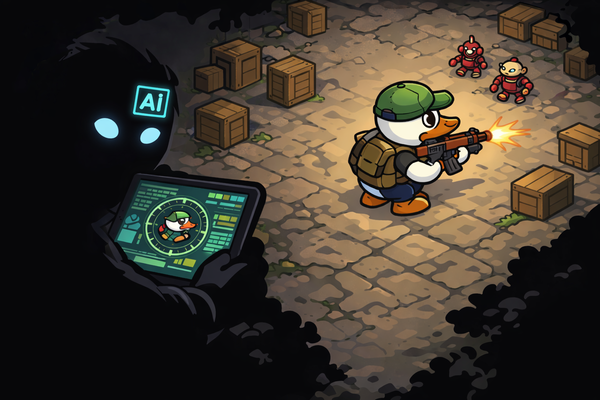

# Adaptive Enemy AI (自适应敌人 AI)

[English](README.md) · [한국어](README.ko.md) · **简体中文**

一个用于 **《逃离鸭科夫》(Escape from Duckov)** 的敌人 AI 模组。敌人会读取玩家的装备与战斗方式，
并实时调整自己的战术。

[](https://steamcommunity.com/sharedfiles/filedetails/?id=3661223437)
[](LICENSE)

> ⚠️ **本模组需要 Harmony 模组。**



---

## 功能

**装备响应** — 敌人会根据你的武器与护甲在激进判断与防守判断之间切换。当前距离下你的武器占优时敌人
会压上来；你的护甲很厚时敌人会拉开距离并优先闪避。

**行为学习** — 采样移动强度、瞄准变化、冲刺与开火频率，汇总为统计数据后回馈到 AI 参数：反应速度、
射速倾向、瞄准精度、追击多久后放弃。旧样本会衰减，因此最近的打法权重更高。

**射击模式反制** — 读取你即将开火的时机并提前移动，让固定瞄准不再奏效。

**闪避冲刺** — 敌人会对飞来的子弹和近战挥击尝试闪避冲刺。概率受你的命中率、射击模式、掩体状态和
交战时长的上下限约束，不会变成必定闪避。

**视野模型 (v1.3.9)** — 视野被拆成三级，取代游戏原本单一的 `noticed` 标志：原始视野（距离、视野角、
墙体射线）、感知（原始 ∪ 3 秒记忆 ∪ 最近受击）、交战（通过反应延迟的确认视野）。敌人不再隔墙察觉、
追击或射击。

**声音是搜索而非追踪** — 听到枪声的敌人会走向*声音发出的位置*进行搜索。仅凭声音不会让它跟随你的
实时位置。

**存档整合** — 行为档案随游戏存档一起保存（SavesSystem + ES3）。

## 实现方式

全部通过 Harmony 叠加在游戏原有 AI 之上。模组不替换行为树，只是加门控和微调。

| 区域 | 挂钩点 |
|---|---|
| 察觉 / 仇恨 / 瞄准门控 | `AICharacterController` 补丁 |
| 无视野时抑制扳机 | `CharacterMainControl.Trigger` 前缀 |
| 闪避冲刺 | `CA_Dash` / `CharacterMainControl` 冲刺补丁 |
| 飞来投射物检测 | `Projectile` 补丁 |
| 移动与路径跟随 | `AI_PathControl` 补丁 |
| 按预设排除 | `PerAIPatchControl` |

阅读代码时值得知道的一点：原版中 `AICharacterController.noticed` 的含义是**"听到了/被打了"**，
而不是"看到了"（只在 `OnSound`·`OnHurt` 中置为 true）。真正的视野检测在行为树的
`SearchEnemyAround` + `CheckObsticle`，而 `Update` 只要在 `forceTracePlayerDistance` 范围内就会
无视墙体把 `searchedEnemy` 设为玩家。把这两者当作"察觉"，正是 v1.3.9 之前隔墙仇恨的成因。

## 设置

所有调参值都在 `Settings/AdaptiveAISettings.cs` 中，以静态属性加默认值的形式存在 — 装备权重、
全局 AI 强度、闪避概率上下限、战斗爬升、视野角与视野距离、视野记忆、声音搜索半径与记忆、反应延迟。
调试浮层（`Services/DebugOverlay.cs`）可以在运行时切换其中一部分。

**目前还没有游戏内选项界面或配置文件。** 这是呼声最高的功能，也是最适合参与贡献的地方。

## 构建

```bash
dotnet build AdaptiveEnemyAI.csproj
```

如果默认的 Steam 路径不对，把 `Local.props.example` 复制为 `Local.props` 并指向你的游戏安装目录。
`Local.props` 已被 gitignore。

依赖为 NuGet 包（`Ducky.Sdk`、`Lib.Harmony`）；本仓库不包含任何游戏 DLL。

## 参与贡献

欢迎提交 issue 和 pull request。相比 Steam 评论，bug 报告更有用，因为可以附带复现步骤、日志和讨论。
游戏日志位置：

```
%USERPROFILE%\AppData\LocalLow\TeamSoda\Duckov\Player.log
```

## 许可证

[MIT](LICENSE)。第三方与同人项目声明见 [NOTICE.md](NOTICE.md)。
